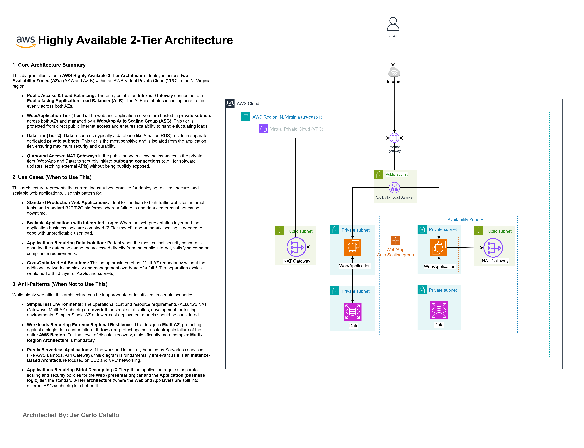
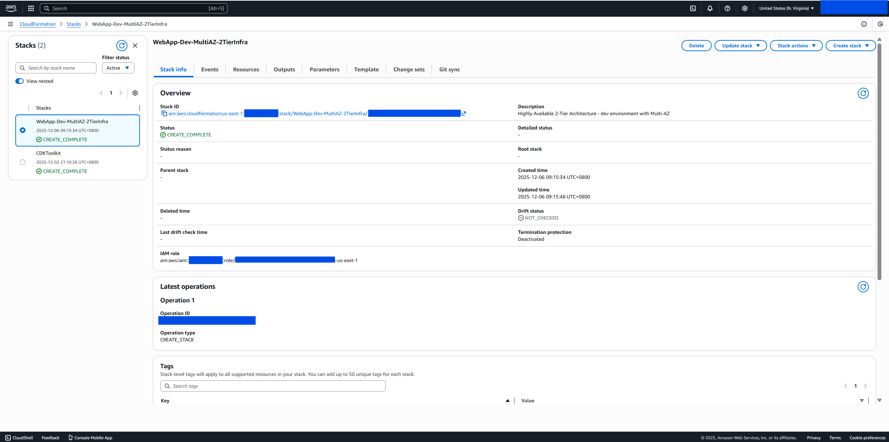
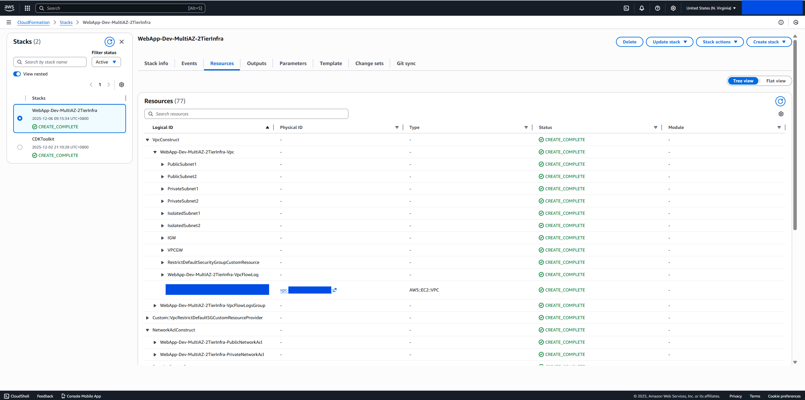
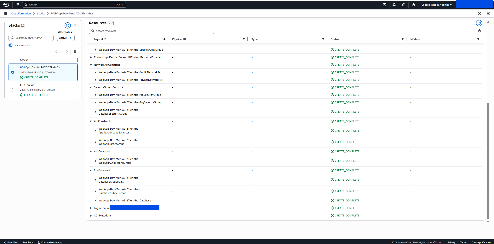
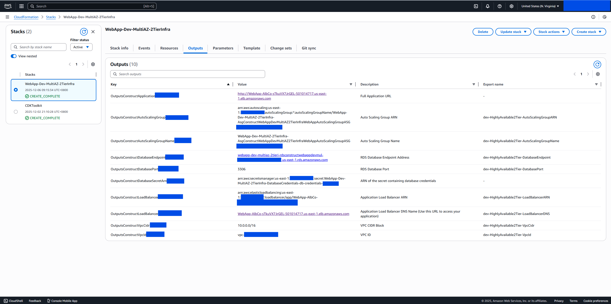
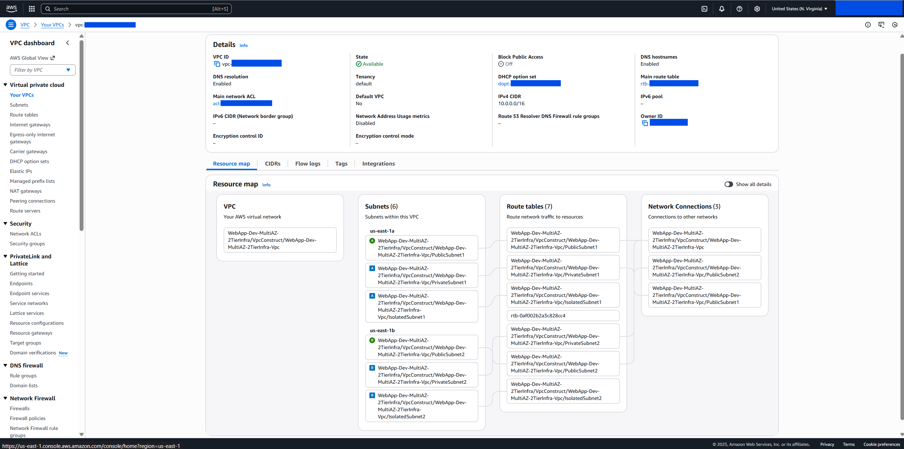
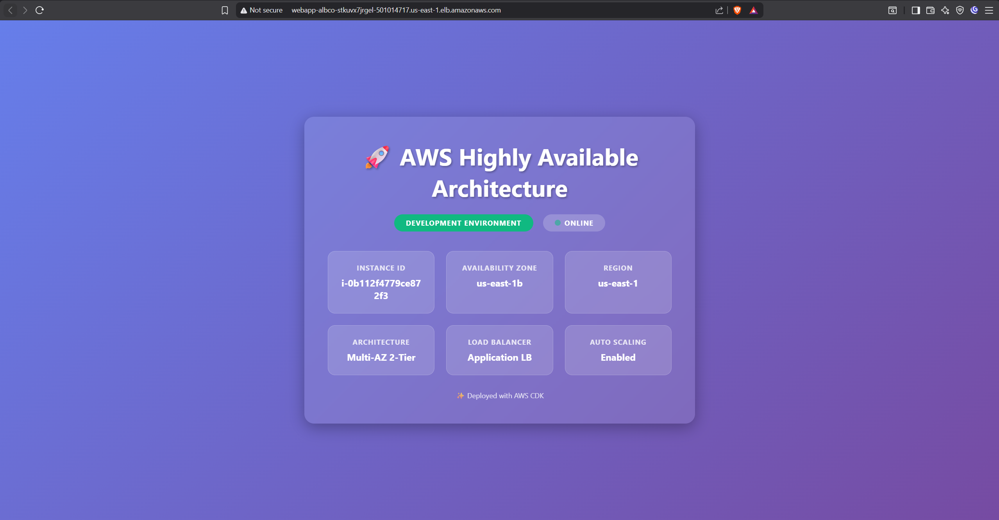

# AWS Highly Available 2-Tier Architecture


> **Production-grade infrastructure made repeatable**: Deploy highly available, auto-scaling applications with a dedicated database tier across multiple availability zones with battle-tested Infrastructure as Code.

**⚠️ EDUCATIONAL PURPOSE ONLY**: This project is designed for learning AWS infrastructure patterns and CDK development. Not intended for production use without proper review, testing, and customization.

**📝 Architecture Note**: This is a **true 2-tier architecture** with a **Presentation Tier** (web/application servers) and a **Data Tier** (managed relational database). Clean separation of concerns with dedicated RDS Multi-AZ database for data persistence.

---

## Quick Start

### Prerequisites
- AWS CLI configured with credentials
- Node.js 18+ and npm
- AWS CDK CLI: `npm install -g aws-cdk`

### Deploy in 3 Steps

```bash
# 1. Install dependencies
npm install

# 2. Configure environment
cp .env.example .env
# Edit .env: ENVIRONMENT=development (or production or staging)

# 3. Deploy
cdk deploy
```

Infrastructure deploys in ~15-20 minutes.

---

## Key Features

- **True 2-Tier Architecture** - Presentation tier (ALB + ASG) and Data tier (RDS Multi-AZ)
- **Managed RDS Database** - Multi-AZ with automatic failover, backups, and encryption
- **Multi-AZ Deployment** - 2-3 availability zones for high availability across both tiers
- **Auto Scaling** - CPU-based horizontal scaling with configurable thresholds (2-10+ instances)
- **Security Hardened** - Multi-layer defense (NACLs, Security Groups, encryption, IMDSv2)
- **JSON Configuration** - Environment-specific configs (dev/staging/prod)
- **Infrastructure as Code** - Full TypeScript with AWS CDK
- **Comprehensive Test Coverage** - Unit tests validating all constructs

---

## Architecture Overview & Components



This project implements a **True AWS Highly Available 2-Tier Architecture** pattern - separating the presentation layer (web/application servers) from the data layer (managed relational database). This design provides **scalability, reliability, security, and high availability** with clean separation of concerns.

**Deployment Model:**

**Presentation Tier (Web/Application Layer):**
- **Internet Gateway** → **Application Load Balancer (Multi-AZ, Public Subnets)** → **Auto Scaling Group (Private Subnets)**
- Load balancer distributes traffic across healthy instances
- Auto-scaling group manages compute capacity based on demand
- NAT Gateways enable outbound internet access (updates, package downloads)

**Data Tier (Database Layer):**
- **RDS Multi-AZ** deployed in isolated private subnets
- Automatic failover between Availability Zones
- Automated backups with configurable retention
- Encryption at rest with AWS KMS
- Managed by AWS (patching, maintenance, monitoring)

**High-Level Traffic Flow:**
```
User → Internet → Internet Gateway → ALB (Public Subnets) → 
ASG Instances (Private Subnets, Presentation Tier) → 
RDS Database (Isolated Private Subnets, Data Tier)
```

## Screenshots

- CloudFormation stack overview for the dev Multi-AZ deployment: `CREATE_COMPLETE` with drift checks available.
	
- CloudFormation resources tree showing VPC, NACLs, Security Groups, ALB, and ASG constructs created by the stack.
	
- CloudFormation detailed resources view displaying all infrastructure components and their relationships.
	
- CloudFormation outputs section showing stack exports including ALB DNS name, RDS endpoint, and other key resources.
	
- AWS VPC resource map showing the 2-tier architecture with public/private subnets, NAT gateways, and database tier across multiple availability zones.
	
- Deployed web app hero page served via the Application Load Balancer, showing instance metadata and Multi-AZ 2-tier status.
	

---

## Detailed Architecture Components

### Network Layer (VPC)

**VPC Configuration:**
- **CIDR**: 10.0.0.0/16
- **Availability Zones**: 2 (dev) or 3 (production)
- **Subnets**: 
  - Public subnets (10.0.0.0/24, 10.0.1.0/24) - Host ALB and NAT Gateways
  - Private subnets (10.0.10.0/24, 10.0.11.0/24) - Host ASG instances
  - Isolated subnets - Host RDS database (no internet access)
- **NAT Gateways**: One per AZ for outbound internet access

### Presentation Tier (Web/Application Layer)

**Application Load Balancer (ALB):**
- **Placement**: Public subnets for internet-facing traffic
- **Target Type**: EC2 instances in Auto Scaling Group
- **Cross-Zone**: Enabled for even distribution
- **Health Checks**: HTTP on port 80, 30-second intervals
- **Idle Timeout**: 60 seconds (configurable)
- **Deletion Protection**: Disabled in dev, enabled in production

**Auto Scaling Group (ASG):**
- **Placement**: Private subnets across multiple AZs
- **Instance Types**:
  - Development: t2.micro (1 vCPU, 1GB RAM)
  - Production: t3.small (2 vCPU, 2GB RAM)
- **Capacity**:
  - Development: Min 2, Desired 2, Max 6
  - Production: Min 3, Desired 3, Max 10
- **Scaling Policy**: Target tracking based on CPU utilization (60-70%)
- **Health Checks**: ELB health checks with 5-minute grace period
- **AMI**: Amazon Linux 2023 with user data script
- **Storage**: 20-30GB GP3 EBS volumes, encrypted with KMS, 3000 IOPS
- **Security**: IMDSv2 enforced, restricted security group

### Data Tier (Database Layer)

**RDS Multi-AZ Database:**
- **Engine**: MariaDB 10.11 (configurable: MySQL, PostgreSQL)
- **Instance Classes**:
  - Development: t3.micro (1 vCPU, 1GB RAM)
  - Production: t3.small or larger (2+ vCPU, 2+ GB RAM)
- **Storage**:
  - Initial: 20GB (dev) to 30GB (prod)
  - Auto-scaling: Up to 100GB with autoscaling enabled
  - Volume Type: GP3 (gp2 in some regions)
- **Multi-AZ**: Enabled for automatic failover across AZs
- **Backups**: Automated daily backups with retention (7 days dev, 7 days prod)
- **Maintenance Window**: Sunday 04:00-05:00 UTC
- **Encryption**: KMS encryption at rest, SSL/TLS in transit
- **Credentials**: Managed by AWS Secrets Manager
- **Subnet Placement**: Isolated private subnets (no internet access)
- **CloudWatch Logs**: Error, general, and slow query logs with configurable retention

### Security Architecture

**Defense in Depth (Multi-Layer Security):**
1. **Network ACLs (Subnet-level, stateless):**
  - Public: Allow HTTP (80), HTTPS (443), ephemeral ports (1024-65535)
  - Private: Restrict traffic to required ports (e.g., HTTP from ALB SG CIDR as needed)

2. **Security Groups (Instance-level, stateful):**
  - **ALB SG**: Allow HTTP/HTTPS from internet (0.0.0.0/0)
  - **ASG SG**: Allow HTTP from ALB SG only

3. **Encryption:**
  - All EBS volumes encrypted at rest (AWS KMS)
  - IMDSv2 enforcement prevents credential theft

### Architecture Walkthrough

#### Public Access & Load Balancing
The entry point is an **Internet Gateway** connected to a **public-facing Application Load Balancer (ALB)**. The ALB distributes incoming user traffic evenly across both availability zones, ensuring that traffic is never concentrated on a single data center. This provides the foundation for high availability at the presentation layer.

#### Web/Application Tier (Tier 1)
The web and application servers are hosted in **private subnets** across both availability zones and managed by a **Web/App Auto Scaling Group (ASG)**. This tier is protected from direct public internet access and ensures scalability to handle fluctuating loads. Instances automatically scale up during high traffic and scale down during low traffic periods based on CPU utilization metrics.

#### Data Tier (Tier 2)
Data resources (the **Amazon RDS Multi-AZ database**) reside in separate, dedicated private subnets. This tier is the most sensitive and is isolated from the application tier, ensuring maximum security and durability. The database is never directly accessible from the public internet, satisfying strict security and compliance requirements.

#### Outbound Access
**NAT Gateways** in the public subnets allow the instances in the private tiers (Web/App and Data) to securely initiate outbound connections—such as software updates, security patches, and external API calls—without being publicly exposed. Each availability zone has its own NAT Gateway for independent outbound access.

---

## When to Use This Architecture

This architecture represents a current industry best practice for deploying resilient, secure, and scalable web applications. It provides robust Multi-AZ redundancy with clear separation between presentation and data layers.

### ✅ Use Cases (When to Use This)

**1. Standard Production Web Applications**
- Medium to high-traffic websites, internal tools, and standard B2B/B2C platforms
- Ideal when a failure in one data center must not cause downtime
- E-commerce platforms, content management systems, business applications
- Applications requiring persistent data storage with high availability

**2. Scalable Applications with Integrated Logic**
- When the web presentation layer and application business logic are combined (2-Tier model)
- Automatic scaling is needed to cope with unpredictable user load
- Applications with moderate data storage requirements (20GB - 1TB+)
- Predictable traffic patterns with auto-scaling support

**3. Applications Requiring Data Isolation**
- Perfect when the most critical security concern is ensuring the database cannot be accessed directly from the public internet
- Satisfies common compliance and regulatory requirements (PCI-DSS, HIPAA, SOC 2)
- Applications requiring relational data with ACID guarantees
- Complex queries and transactions (use case for MariaDB, MySQL, PostgreSQL)
- Applications needing automated backups and point-in-time recovery

**4. Cost-Optimized HA Solutions**
- Organizations seeking robust Multi-AZ redundancy without additional network complexity
- More cost-effective than full 3-Tier separation (which would add a third layer of ASGs and subnets)
- Provides production-ready infrastructure with minimal operational overhead
- Automatic database failover and recovery with encryption at rest and in transit

### ❌ Anti-Patterns (When NOT to Use This)

**1. Simple/Test Environments**
- The operational cost and resource requirements (ALB, two NAT Gateways, Multi-AZ subnets) are overkill for simple static sites
- Development or testing environments have simpler, lower-cost alternatives
- Single-AZ or serverless deployment models are more appropriate for these scenarios
- Risk of excessive infrastructure costs for minimal requirements

**2. Workloads Requiring Extreme Regional Resilience**
- This design is Multi-AZ, protecting against a single data center failure within a region
- Does NOT protect against a catastrophic failure of the entire AWS Region
- For multi-region disaster recovery and resilience, a significantly more complex **Multi-Region Architecture** is required
- Consider AWS Route 53 with failover policies and cross-region replicas for true DR

**3. Purely Serverless Applications**
- If the workload is entirely handled by Serverless services (Lambda, API Gateway, DynamoDB)
- This diagram is fundamentally irrelevant as it is an instance-based architecture focused on EC2 and VPC networking
- Serverless alternatives (DynamoDB, Aurora Serverless, Lambda) scale to zero and have different cost models
- Better suited for microservices and event-driven architectures

**4. Applications Requiring Strict Decoupling (3-Tier)**
- If the application requires separate scaling and security policies for the Web (presentation) tier and Application (business logic) tier
- The standard **3-Tier architecture** is a better fit, where Web and App layers are split into different ASGs/subnets
- Allows independent scaling and security policies for each tier
- Necessary when presentation and application logic have vastly different resource requirements or security needs

---

## High Availability & Operational Features

### Multi-AZ Redundancy
- **ALB**: Automatically distributes across AZs
- **ASG**: Instances balanced across AZs (minimum 1 per AZ)
- **NAT Gateways**: One per AZ (independent failure domains)
- **RDS Multi-AZ**: Automatic failover to standby in another AZ

### Automatic Failover
- **ASG**: Automatically replaces failed instances (3-5 minutes)
- **RDS**: Automatic failover to standby in another AZ (typically 1-2 minutes)
- **ALB**: Routes traffic only to healthy targets

### Health Monitoring
- ALB health checks every 30 seconds
- ASG replaces unhealthy instances automatically
- CloudWatch alarms for critical metrics
- Enhanced monitoring available for RDS

### Horizontal Scaling
- **Auto Scaling**: Adjusts compute capacity based on CPU utilization
- **Scale-out**: 60 seconds cooldown (rapid response to load increases)
- **Scale-in**: 300 seconds cooldown (prevent unnecessary scaling down)
- **Storage Autoscaling**: RDS storage automatically expands up to 100GB

## Cost Optimization

| Environment | Est. Monthly Cost | Notes |
|-------------|-------------------|-------|
| Development | $50-80 | t2.micro ASG (2 instances), t3.micro RDS, 2 AZs |
| Production | $150-250 | t3.small ASG (3 instances), t3.small RDS, 3 AZs |

**Cost Factors:**
- **NAT Gateway**: ~$32/month per gateway + data transfer (~$0.045/GB)
- **RDS Multi-AZ**: Instance hourly rate + storage (GP3) + automated backups
- **EBS Storage**: 3000 IOPS GP3 volumes for instances (~$0.125/GB/month + IOPS)
- **Data Transfer**: Between AZs, out to internet
- **Load Balancer**: ALB pricing (~$0.0225/hour) + LCU charges

**Cost Reduction Tips:**
- Use Reserved Instances for predictable workloads (40-70% discount)
- RDS: Consider single-AZ for dev environments (50% cost reduction)
- Downsize during off-hours using scheduled scaling policies
- Enable automated backups with shorter retention in non-prod

Costs vary significantly based on instance types, data transfer volumes, and usage patterns.

## Monitoring & Logging

**Infrastructure Monitoring:**
- **VPC Flow Logs**: Network traffic analysis (7 days dev, 30 days prod)
- **CloudWatch Metrics**: CPU, network, EBS volume metrics (1-minute granularity)
- **ALB Monitoring**: Request count, target health, response times, HTTP 4xx/5xx errors
- **ASG Monitoring**: Instance count, scaling activities, desired capacity changes
- **RDS Monitoring**: CPU, database connections, replication lag, backup status

**Application Logging:**
- **CloudWatch Logs**: Application and error logs with configurable retention
- **RDS Logs**: Error, general, and slow query logs (7 days dev, 30 days prod)
- **Log Groups**: Organized by component with retention policies

**Alarms & Notifications:**
- Auto-scaling triggers based on CPU utilization (60-70% threshold)
- Health check failures automatically replace unhealthy instances
- RDS automated failover on primary instance failure (typically 1-2 minutes)

## Best Practices

✅ Use this architecture for standard web applications with persistent data storage  
✅ Configure auto-scaling policies based on actual traffic patterns  
✅ Enable CloudWatch alarms for critical metrics (CPU, RDS connections)  
✅ Test failover scenarios regularly (both ASG and RDS)  
✅ Monitor costs with AWS Cost Explorer  
✅ Use Secrets Manager for RDS credentials (automatic rotation)  
✅ Enable enhanced monitoring on RDS for detailed performance insights  
✅ Set up regular backup testing and point-in-time recovery verification

---

## Project Structure

```
├── bin/
│   ├── app.ts                      # CDK app entry point
│   └── app.js                      # Compiled app
├── lib/
│   ├── stack.ts                    # Main stack
│   ├── stack.js                    # Compiled stack
│   └── constructs/                 # Modular constructs
│       ├── compute/
│       │   ├── asg-construct.ts    # Auto Scaling Group construct
│       │   └── asg-construct.js    # Compiled
│       ├── database/
│       │   ├── database-instance-construct.ts  # RDS database construct
│       │   └── database-instance-construct.js  # Compiled
│       ├── load-balancing/
│       │   ├── alb-construct.ts    # Application Load Balancer construct
│       │   └── alb-construct.js    # Compiled
│       ├── networking/
│       │   ├── vpc-construct.ts    # VPC construct
│       │   ├── security-group-construct.ts     # Security groups construct
│       │   ├── network-acl-construct.ts        # Network ACLs construct
│       │   └── *.js                # Compiled files
│       └── outputs/
│           ├── outputs-construct.ts    # CloudFormation outputs
│           └── outputs-construct.js    # Compiled
├── config/                         # Environment-specific configurations
│   ├── development.json            # Dev environment config
│   ├── staging.json                # Staging environment config
│   ├── production.json             # Production environment config
│   ├── stack-config.ts             # Config loader with type safety
│   └── stack-config.js             # Compiled config loader
├── scripts/                        # Deployment and utility scripts
│   ├── user-data-dev.sh            # Development user data script
│   ├── user-data-staging.sh        # Staging user data script
│   └── user-data-production.sh     # Production user data script
├── test/                           # Unit tests (Jest)
│   ├── stack.test.ts               # Main stack tests
│   ├── stack.test.js               # Compiled tests
│   └── constructs/
│       ├── alb-construct.test.ts
│       ├── asg-construct.test.ts
│       ├── database-instance-construct.test.ts
│       ├── network-acl-construct.test.ts
│       ├── outputs-construct.test.ts
│       ├── security-group-construct.test.ts
│       ├── vpc-construct.test.ts
│       └── *.js                    # Compiled test files
├── assets/                         # Project assets
│   └── aws-screenshots/            # Architecture and deployment screenshots
├── cdk.json                        # CDK configuration
├── jest.config.js                  # Jest testing framework config
├── tsconfig.json                   # TypeScript configuration
├── package.json                    # Dependencies and scripts
└── README.md                       # This file
```

---

# Configuration Guide

## ⚙️ Configuration-Driven Architecture

This project is **fully configuration-driven** using **JSON configuration files** for different environments. All infrastructure parameters are externalized - change settings without modifying any TypeScript code!

## How It Works

```
.env file (ENVIRONMENT=dev or production)
       ↓
development.json or production.json (JSON Configuration)
       ↓
stack-config.ts (Loads JSON + Type Safety)
       ↓
Stack Constructs (Implementation)
       ↓
AWS Resources (Deployment)
```

## Environment-Specific Configuration Files

### Development Configuration

**`config/development.json`** - Development environment settings:

```json
{
  "stackName": "WebApp-Dev-MultiAZ-2TierInfra",
  "environment": {
    "name": "dev",
    "region": "us-east-1"
  },
  "compute": {
    "asg": {
      "minCapacity": 2,
      "maxCapacity": 6,
      "instanceClass": "T2",
      "instanceSize": "MICRO"
    }
  },
  "network": {
    "availabilityZones": 2,
    "enableFlowLogs": true
  },
  "database": {
    "engine": "mariadb",
    "engineVersion": "10.11",
    "instanceSize": "MICRO",
    "multiAz": true
  }
}
```

### Production Configuration

**`config/production.json`** - Production environment settings:

```json
{
  "stackName": "WebApp-Prod-MultiAZ-2TierInfra",
  "environment": {
    "name": "production",
    "region": "us-east-1"
  },
  "compute": {
    "asg": {
      "minCapacity": 3,
      "maxCapacity": 10,
      "instanceClass": "T3",
      "instanceSize": "SMALL"
    }
  },
  "network": {
    "availabilityZones": 3,
    "enableFlowLogs": true
  },
  "database": {
    "engine": "mariadb",
    "engineVersion": "10.11",
    "instanceSize": "SMALL",
    "multiAz": true
  }
}
```

## Switching Between Environments

### Using .env file (Recommended)

```bash
# Create .env file
cp .env.example .env

# Edit .env file
# For development:
ENVIRONMENT=dev

# For production:
ENVIRONMENT=production

# Deploy
npx cdk deploy
```

### Using environment variable

```bash
# Development deployment
ENVIRONMENT=dev npx cdk deploy

# Production deployment
ENVIRONMENT=production npx cdk deploy
```

## What You Can Configure

✅ **Stack & Resources**: Stack name, all resource names with prefixes  
✅ **Network**: VPC CIDR, subnet masks, NAT gateway count, Flow Logs  
✅ **Security**: Ports, protocols, CIDR ranges, Network ACLs  
✅ **Load Balancer**: Health checks, timeouts, protocols, deregistration delay  
✅ **Auto Scaling**: Capacity, instance types, scaling policies, cooldowns  
✅ **EC2 Instances**: User data scripts, storage, IMDSv2 settings  
✅ **Monitoring**: CloudWatch settings, log retention, detailed monitoring  
✅ **Outputs**: Export names, toggle outputs on/off  

## Configuration Benefits

🎯 **JSON-based** - Edit configs without TypeScript knowledge  
🎯 **Environment-specific** - Separate configs for dev/staging/prod  
🎯 **Type-safe** - TypeScript interfaces ensure config validity  
🎯 **Version controlled** - Track config changes in git  
🎯 **Easy customization** - Change infrastructure without touching code  
🎯 **Self-documenting** - JSON is readable and searchable  

## Configuration Schema

The TypeScript loader (`stack-config.ts`) provides:
- **Type safety** - Validates JSON structure at load time
- **CDK type conversion** - Converts strings to CDK enum types
- **Default values** - Handles missing optional fields
- **Error messages** - Clear errors if config files are missing or invalid

## Development vs Production Differences

| Configuration | Development | Production |
|---|---|---|
| **Stack Name** | WebApp-Dev-MultiAZ-2TierInfra | WebApp-Prod-MultiAZ-2TierInfra |
| **Availability Zones** | 2 AZs | 3 AZs |
| **ASG Min/Desired/Max** | 2/2/6 instances | 3/3/10 instances |
| **Instance Type** | t2.micro | t3.small |
| **EBS Volume Size** | 20 GB | 30 GB |
| **RDS Instance Type** | t3.micro | t3.small |
| **RDS Storage** | 20GB → 100GB auto | 30GB → 100GB auto |
| **RDS Multi-AZ** | Enabled | Enabled |
| **Backup Retention** | 7 days | 7 days |
| **Flow Logs Retention** | 7 days | 30 days |
| **Target CPU** | 70% | 60% |
| **ALB Deletion Protection** | Disabled | Enabled |
| **RDS Deletion Protection** | Disabled | Enabled |

**Key Production Enhancements:**
- ✅ More capacity and redundancy (3 AZs vs 2)
- ✅ Larger instance types for better performance
- ✅ Larger RDS instance for higher throughput
- ✅ Extended flow log retention (30 days vs 7)
- ✅ Deletion protection enabled on critical resources
- ✅ More aggressive scaling (60% CPU threshold vs 70%)

## Customizing Configurations

### Example: Modify User Data Scripts

Edit `config/development.json`:

```json
{
  "compute": {
    "asg": {
      "userData": {
        "commands": [
          "#!/bin/bash",
          "yum update -y",
          "yum install -y httpd",
          "systemctl start httpd",
          "systemctl enable httpd",
          "echo 'Custom application setup' > /var/www/html/index.html"
        ]
      }
    }
  }
}
```

### Example: Adjust Scaling Thresholds

```json
{
  "compute": {
    "asg": {
      "minCapacity": 1,
      "maxCapacity": 4,
      "targetCpuUtilization": 50,
      "scaleInCooldown": 600,
      "scaleOutCooldown": 30
    }
  }
}
```

### Example: Adjust Network Settings

```json
{
  "network": {
    "vpc": {
      "cidr": "10.0.0.0/16",
      "enableFlowLogs": true
    },
    "natGateways": {
      "perAz": true
    }
  }
}
```

## Creating Additional Environments

You can create configurations for staging, QA, or other environments:

```bash
# Create staging configuration
cp config/development.json config/staging.json

# Edit staging.json with staging-specific settings
# Then deploy with:
ENVIRONMENT=staging npx cdk deploy
```

---

## Testing

```bash
npm test              # Run all tests
npm test -- --coverage # With coverage
```

51 unit tests validate infrastructure configuration.

---

## Common Commands

```bash
cdk ls                # List stacks
cdk diff              # Preview changes
cdk synth             # Generate CloudFormation
cdk deploy            # Deploy infrastructure
cdk destroy           # Remove infrastructure
```

---

## License

MIT License - see [LICENSE](LICENSE) file for details.

**Educational Disclaimer**: This project is provided for educational purposes only. Users are responsible for understanding AWS costs, security implications, and best practices before deploying to any AWS environment.

---

## Contributing

Contributions are welcome! Please feel free to submit issues or pull requests.

---

**Author**: Jer Carlo Catallo  
**Purpose**: Educational demonstration of AWS CDK and highly available architecture patterns


